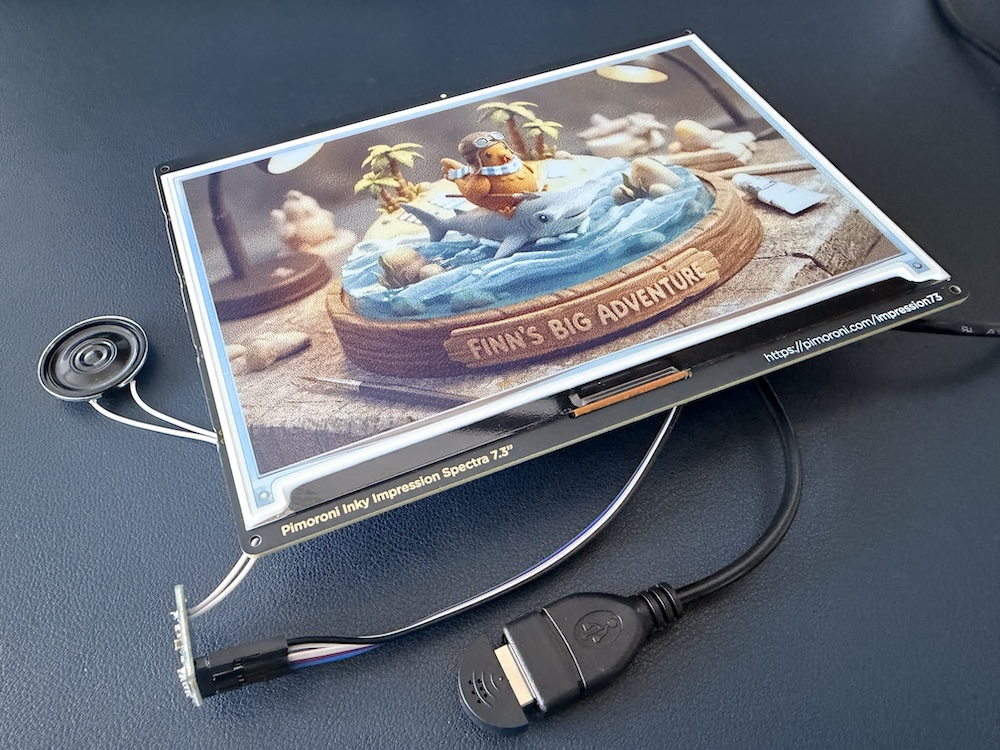

# An Interactive E-ink Picture Frame (Wall-E)

This project brings a "brain" to an interactive picture frame (nicknamed **Wall-E**), powered by the Google Gemini API. It captures voice commands, processes them using Gemini's multimodal capabilities, and displays generated art on a Pimoroni Inky Impression e-ink display.

Full build video on [YouTube](https://youtu.be/_-2Q8pRQm-8)



---

## ✨ Features

- **Voice-to-Art**: Record audio prompts that Gemini transcribes and uses to generate unique images.
- **Multimodal AI**: Powered by `gemini-3.1-flash-image-preview` for advanced multimodal generation.
- **E-ink Integration**: Automatically resizes and optimizes images for the **Pimoroni Inky Impression 7.3" Spectra**.
- **Audio Feedback**: Features a custom soundboard for system status (activation, processing, success, and errors).
- **Event-Driven**: Triggered by physical hardware buttons.
- **Production-Ready**: Includes a systemd service for autonomous operation on startup.

---

## 🔌 Hardware

- **Controller**: Raspberry Pi Zero 2W
- **Display**: Pimoroni Inky Impression 7.3" (600x448) Spectra e-ink
- **Audio Input**: USB Microphone
- **Audio Output**: [MAX98357 I2S Class-D Mono Amp](https://learn.adafruit.com/adafruit-max98357-i2s-class-d-mono-amp/raspberry-pi-wiring)
- **Enclosure**: [3D-Printed 7.3" Frame](https://makerworld.com/en/models/1482862-inky-impression-2025-edition-7-3-frame#profileId-1548643) (Remixed by TrisM)

### Amp Wiring (Raspberry Pi)

| Amp Pin | Raspberry Pi Pin |
| :--- | :--- |
| Vin | 5V Power |
| GND | Ground |
| DIN | GPIO 21 |
| BCLK | GPIO 18 |
| LRCLK | GPIO 19 |

---

## 🛠️ Setup (Mac Iteration)

1.  **Dependencies**: Managed via `uv`. Run `uv sync` to install everything.
2.  **API Key**:
    - Copy `.env.example` to `.env`.
    - Add your `GEMINI_API_KEY` from [Google AI Studio](https://aistudio.google.com/app/apikey).
3.  **Run**:
    ```bash
    uv run labs/brain_mac.py
    ```

---

## 🍓 Raspberry Pi Deployment

### 1. Prerequisites
Ensure you have `uv` installed on your Raspberry Pi:
```bash
curl -LsSf https://astral.sh/uv/install.sh | sh
source $HOME/.local/bin/env
```

### 2. Transfer the Code
Clone this repository to your Pi:
```bash
git clone https://github.com/lahirumaramba/wall-e.git
cd wall-e
```

### 3. Verify Hardware
Check that your USB Microphone and Inky Impression display are detected:
```bash
arecord -l  # Verify your USB Microphone is listed
# Inky Impression: Detected automatically via the Python script
```

### 4. Setup Environment
Install core and Pi-specific dependencies:
```bash
cp .env.example .env
nano .env # Configure your API key and hardware settings
uv sync --extra pi
```

### 5. Run the Brain
```bash
uv run brain.py
```
Press **Button A** on the Inky Impression to trigger a recording.

---

## 🎨 Inky Impression Support

- **Button Mapping**: Uses GPIO 5 (Button A) for activation.
- **Auto-Detection**: Uses `inky.auto()` for seamless setup.
- **Saturation**: Fine-tune via `INKY_SATURATION` in `.env`.

---

## 🚀 Auto-Start (Systemd)

To run the project automatically on boot:

1.  **Edit the service file**: 
    Open `wall_e.service` and replace `<YOUR_USERNAME>` and `<YOUR_PROJECT_PATH>` with your actual details.
2.  **Install the service**:
    ```bash
    sudo cp wall_e.service /etc/systemd/system/wall-e.service
    sudo systemctl daemon-reload
    sudo systemctl enable wall-e.service
    sudo systemctl start wall-e.service
    ```

---

## 🧪 Experiments (Labs)

The `labs/` directory contains secondary, experimental scripts:
- `labs/brain_mac.py`: A version of the brain optimized for local Mac testing without e-ink hardware.

---

## 🙏 Credits & Acknowledgments

- **Sound Effects**: All sound files used in this project are sourced from [freesound.org](https://freesound.org).
- **3D-Printed Enclosure**: Inky Impression (2025 Edition) 7.3" Frame Remixed by [TrisM](https://makerworld.com/en/models/1482862-inky-impression-2025-edition-7-3-frame#profileId-1548643).
- **Hardware**: Built for the Pimoroni Inky Impression series.
